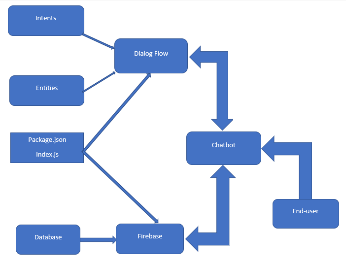
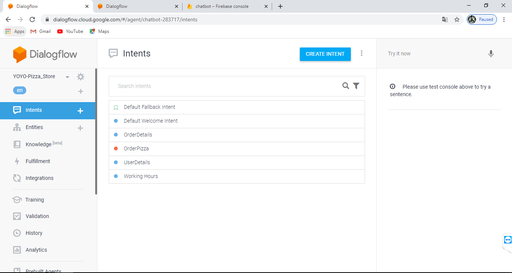
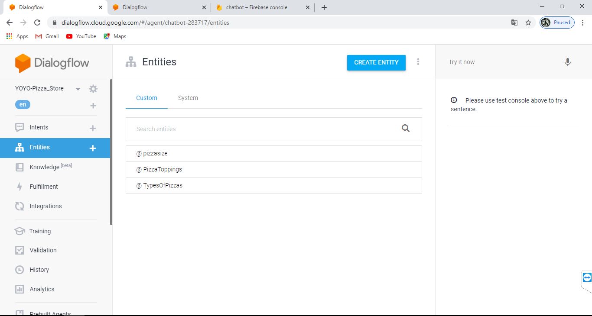
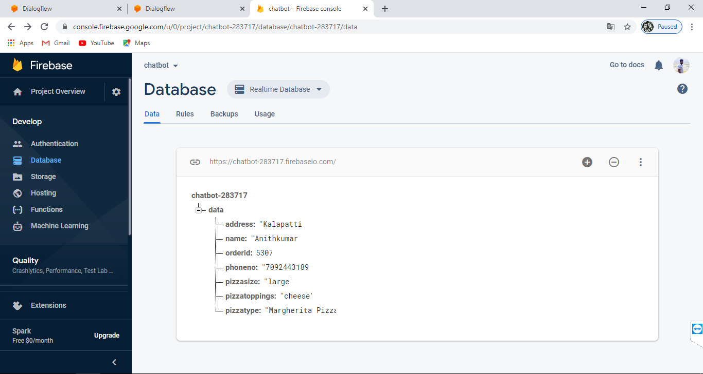
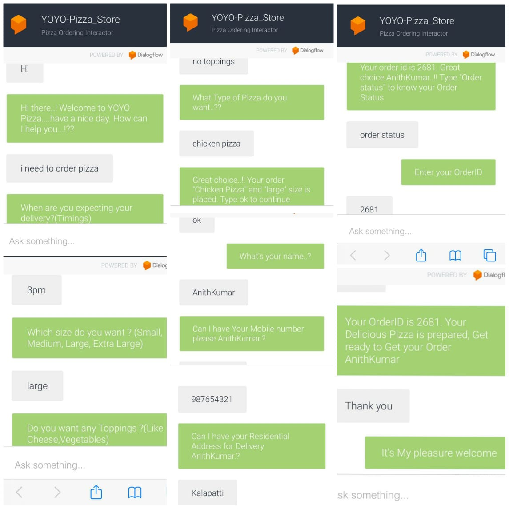

# YOYO-Pizza_Store
Pizza Store Interact Chat Bot

## About the YOYO Pizza Store
Pizza Ordering ChatBot using Dialogflow and Firebase. Using YoYoPizza ChatBot we can order the pizza.

## Appliation Architecture YOYO-Pizza_Chatbot
### Basic Architechture

### Application Architechture

## Dialogflow
The intents and entities is defined in Dialogflow.

## Firebase
Firebase is the realtime database for ChatBot. All the order from chats are stored in firebase database.

## Screenshot of YoYoPizza ChatBot

## Steps to use the bot
Say Hi to the Chat Bot. It will ask How can I help you? 
 
 
As you can ask for the Store Timings,
It will give you the Openning and Closing Timings of the Pizza Store.
 
 
Or Straight away you can ask to place order with the Store by Asking " i need to order pizza"
It will ask for Your expecting Delivery time (like 12am today)
Then It will ask for pizza details as type of you need, size of the pizza and Toppings details 
After collecting all the details it will place your order, Type ok to continue with the Order Details.
 
 
Then for the Delivery purpose it will ask your Name, Residential Address and Mobile Number(Please provide the appropriate details).
 
 
After details Collected It will provide you the "OrderID"
 
 
To Check your Order Status, You can ask for Order status to the Chat Bot(Type "Order Status" For Knowing order status)
 
 
after asking for the order status, The Chat Bot will ask you for the orderID(OrderId will be Provided By the Chat Bot)
 
 
After giving the OrderID, The Chat Bot will return the Order status To the EndUser"
 
 
After that you can say thankyou, The Chat Bot will replay to you...!!!!! 
 
 
